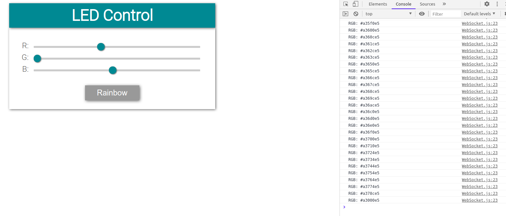

# ESP8266 Wifi module for microcontroller (Arduino etc.)

Send data to the microcontroller from web browser without page refresh using webSocket! RGB slider to send color hex codes to ESP. 
Then ESP sends data over I2C network to the microcontroller.

