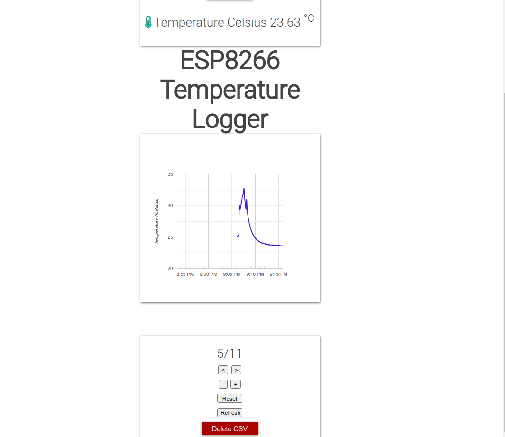
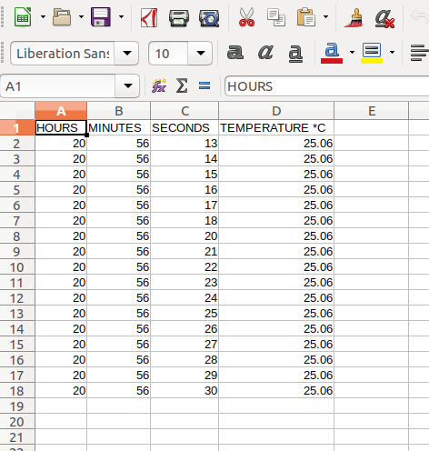

# ESP8266 Wifi module for microcontroller (Arduino etc.)

Control microcontroller from web browser! RGB slider to send color hex codes to ESP. 
Then ESP communicates over I2C network to send data to the microcontroller.

RGB slider

Temperature logger

CSV file export

